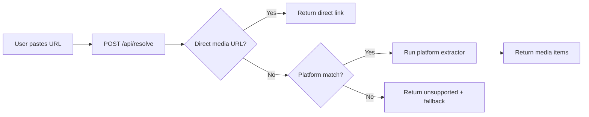

<div align="center">

# 📦 GetBox

### Free, Fast, Open-Source Media Downloader

Download videos, audio, and images from **YouTube**, **Instagram**, **TikTok**, **X/Twitter**, **Reddit**, **SoundCloud**, **Facebook**, **Pinterest** — and any direct media URL.

**No sign-up • No ads • No tracking • Edge-fast on Vercel**


---

## ✨ Features

| Feature | Description |
|---|---|
| 🌐 **Multi-Platform** | YouTube, Instagram, TikTok, X/Twitter, Reddit, Facebook, SoundCloud, Pinterest |
| ⚡ **Edge Runtime** | API runs on Vercel Edge — sub-50ms cold starts worldwide |
| 📱 **Mobile-First UI** | Responsive, dark-mode glassmorphism design with iOS Safari support |
| 🔗 **Direct Links** | Paste any `.mp4`, `.mp3`, `.jpg`, `.png`, `.webp`, `.gif` URL for instant download |
| 🎵 **Playlist Support** | SoundCloud playlists (up to 50 tracks) |
| 📋 **URL History** | Recent URLs saved locally in your browser |
| ⌨️ **Keyboard Shortcuts** | `Ctrl+V` paste anywhere, `Ctrl+Enter` submit, `Esc` dismiss |
| 🛡️ **Zero Dependencies on External APIs** | All extractors are native — no paid third-party services |
| 🔒 **Security Headers** | `X-Content-Type-Options`, `X-Frame-Options`, `Referrer-Policy` |
| 🔍 **SEO Optimized** | JSON-LD structured data, Open Graph, Twitter Cards, sitemap, robots.txt |


### How It Works



1. **User submits a URL** → Client sends `POST /api/resolve` with `{ url }`.
2. **Direct file detection** → If the URL ends in a known extension (`.mp4`, `.mp3`, `.jpg`, etc.), it's returned immediately.
3. **Platform routing** → The hostname is matched to a platform (YouTube, Instagram, etc.).
4. **Extractor runs** → Each platform has a native extractor that fetches public data and extracts media URLs.
5. **Fallback** → If no direct media is found, a fallback action (open original, helper services) is returned.

## 🚀 Deploy to Vercel (Free Plan)

### One-Click Deploy

[](https://vercel.com/new/clone?repository-url=https://github.com/mido-io/GetBox)

### Manual Deploy

```bash
# 1. Clone
git clone https://github.com/mido-io/GetBox.git
cd GetBox

# 2. Install
npm install

# 3. Deploy
npx vercel --prod
```

### Why Vercel Free Plan Works Great

| Aspect | Detail |
|---|---|
| **Edge Functions** | The API route uses `runtime = "edge"` — runs on Vercel's edge network with ~0ms cold starts |
| **Static Frontend** | The homepage is pre-rendered at build time (0 server cost per visit) |
| **Bundle Size** | First Load JS: **~108 KB** (optimized) |
| **No Database** | Zero external dependencies — no Supabase, no Redis, no paid APIs |
| **10s Max Duration** | Edge functions configured for 10s timeout (fits free plan limits) |
| **Security Headers** | Configured via `vercel.json` with immutable caching for static assets |

> **Free plan limits**: 100 GB bandwidth/month, 500K edge function invocations/month, 10s max execution time. GetBox is designed to stay well within these limits.

## 💻 Local Development

```bash
# Install dependencies
npm install

# Start dev server
npm run dev
```

Open [http://localhost:3000](http://localhost:3000).

> No environment variables are required. The app works with zero configuration.

## 📋 Supported Platforms

| Platform | Content Types | Method |
|---|---|---|
| **YouTube** | Video | Invidious → NOBS → API Maestro → Helper services fallback |
| **Instagram** | Photos, Reels, Videos | Multi-source scraper (ddinstagram, vxinstagram + CDN detection) |
| **TikTok** | Video, Audio, Images | TikWM API → oEmbed → Page scan |
| **X / Twitter** | Video, Images | FxTwitter API → OG metadata fallback |
| **Reddit** | Video, Images, Galleries | Public JSON API (galleries, videos, crossposts) |
| **SoundCloud** | Audio, Playlists | Native client_id discovery + stream URL resolution |
| **Facebook** | Video, Images | OG metadata + body scan |
| **Pinterest** | Images, Videos | OG metadata + body scan |
| **Direct URLs** | Any | `.mp4` `.mov` `.webm` `.mp3` `.m4a` `.ogg` `.wav` `.jpg` `.png` `.gif` `.webp` `.avif` |

## ⚡ Performance Optimizations

- **Edge Runtime**: API handler runs on Vercel Edge — deployed to 30+ regions globally
- **Static Generation**: Homepage is pre-rendered at build time (zero SSR cost)
- **Immutable Caching**: Static assets cached with `max-age=31536000, immutable`
- **No External CSS**: All styles are CSS Modules — zero runtime CSS-in-JS overhead
- **Minimal Dependencies**: Only `next`, `react`, `react-dom`, `react-icons` in production
- **AbortController Timeouts**: All fetch requests have 5–10s timeouts to prevent hanging
- **Sequential Fallbacks**: Extractors fail fast and try the next method without waiting

## 🛡️ Security

- `X-Content-Type-Options: nosniff` — prevents MIME-type sniffing
- `X-Frame-Options: DENY` — prevents clickjacking
- `Referrer-Policy: strict-origin-when-cross-origin` — limits referrer data
- `poweredByHeader: false` — hides Next.js version
- URL validation blocks `file:`, `ftp:`, `data:`, `blob:`, `javascript:` protocols
- Input sanitization on all filenames (strips control characters, path traversal)
- No cookies, no auth tokens, no user data stored server-side

## Contributing

Pull requests are welcome. Please ensure you do not break existing extractors.

1.  Fork the repo.
2.  Create a feature branch.
3.  Commit your changes.
4.  Push to the branch.
5.  Create a Pull Request.

## 📄 License

MIT

---

<div align="center">

**Built with [Next.js](https://nextjs.org) • Deployed on [Vercel](https://vercel.com)**

</div>
